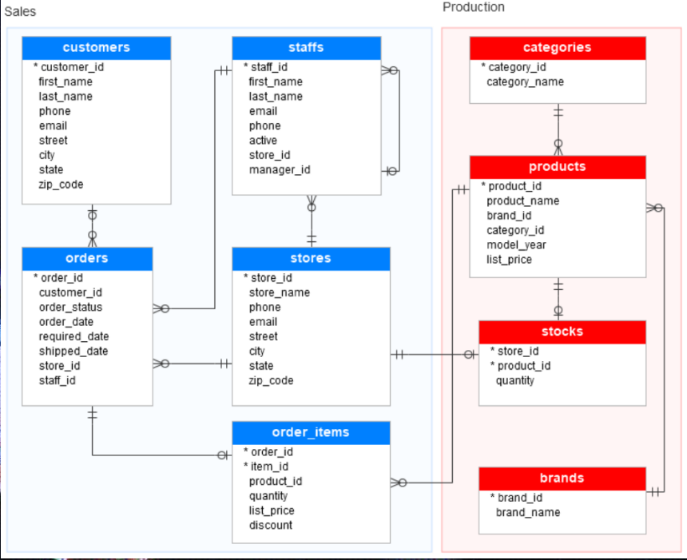

# Bike-Store-Web-Application
Made with C# Razor and ADO.NET Framework

- FileDB e' la cartella contente il file mdf del DB, inoltre sono presenti i file originali contenenti le operazioni di creazione dello schema del database e le relative insert: al fondo del file  "create object" e' stata aggiunta una colonna password mediante un ALTER TABLE

Questo e' lo schema del DB:

- InsertPassword e' un programma in console che permette di creare una password personalizzata per ogni utente, riportandola cifrata con SHA256 sul DB
- Ecommerce e' appunto il programma che permettera' di avviare la Web Application

Il progetto contiene diverse funzionalita' ed e' una versione iniziale

REQUISITI:
- SQL Server Management Studio
- Visual Studio 2022 versione NET 6.0+ con ASP.NET

ISTRUZIONI:
- per il setup caricare il file mdf nella cartella "fileDB" in SQL Server Management Studio 
- altrimenti utilizzare i file sql sempre nella cartella "fileDB" per creare lo schema e popolare il DB
    - scorrere in fondo al file "create objects.sql" ed eseguire l'alter table per aggiungere la colonna password
    - aprire il programma in console nella cartella "InsertPasswords" per creare le password cifrate; sara' possibile vederle dal file nella cartella pw
- avviare il file sln nella cartella "BikeStore" e far partire la compilazione

Enjoy! 
